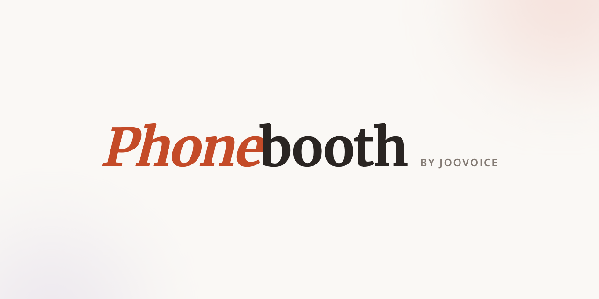

# Phonebooth

<p align="center">
  
</p>

**Let your AI make phone calls.**

[Phonebooth](https://booth.joovoice.com) is a WebMCP-enabled front door for JooVoice. A person or
their browser agent can describe a call, follow its progress, and read the result. Actions that
place or retry a real call remain explicit human decisions in the page.

Phonebooth is developed by [JooCorp Private Limited](https://github.com/JooCorp) and presented by
[JooVoice](https://joovoice.com).

## Try it

Open [booth.joovoice.com](https://booth.joovoice.com) in ChatGPT's in-app browser, or use Chrome
149+ with `chrome://flags/#enable-webmcp-testing` enabled.

## Run locally

Phonebooth requires [Bun](https://bun.sh).

```bash
bun install --frozen-lockfile
bun run start
```

The development server starts at `http://localhost:5180`. With no hosted service selected, the app
uses its deterministic in-browser simulation, so the complete interface can be explored without
credentials or a phone call.

Optional service endpoints can be configured from `.env.example`:

```bash
cp .env.example .env
```

## WebMCP

Phonebooth registers tools through `document.modelContext` (with the corresponding navigator
fallback) and uses declarative WebMCP forms for structured handoffs. Its available tools follow
each call's state: the browser agent can create and inspect requests, wait for updates, and read
completed results. Human-only actions are deliberately not registered as tools.

The page still works as a normal web application when WebMCP is unavailable.

## Check

```bash
bun run check
bun run build
```

The repository contains the Svelte 5 page, reusable presentation components, browser-facing
state-to-tools helper, deterministic MCP simulation, tests, and all static assets needed to build
the project.

## License

Licensed under the [Apache License 2.0](LICENSE). See [NOTICE](NOTICE) for attribution.
